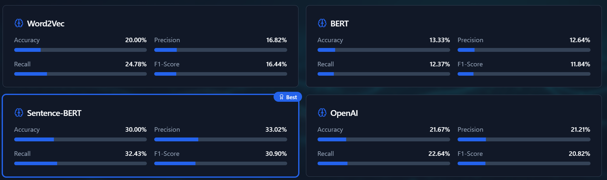

# 📰 Article Analyzer - AI-Powered News Classification System



## 🚀 Overview

Article Analyzer is a sophisticated AI-powered news classification system that leverages multiple machine learning models to categorize news articles with high accuracy. The application provides real-time classification, comprehensive model comparison, and detailed performance analytics.

## ✨ Features

### 🤖 Multi-Model AI Classification
- **Word2Vec/GloVe**: Traditional word embedding approach
- **BERT**: Bidirectional transformer-based classification
- **Sentence-BERT**: Optimized sentence-level embeddings
- **OpenAI**: State-of-the-art language model integration
- **Smart Fallback System**: Ensures classification even when APIs are unavailable

### 📊 Machine Learning Training & Evaluation
- **Logistic Regression**: Custom implementation for each embedding type
- **Comprehensive Metrics**: Accuracy, Precision, Recall, F1-Score
- **Confusion Matrix**: Visual representation of model performance
- **Comparative Analysis**: Side-by-side model performance comparison
- **Real-time Training**: Interactive ML training with progress tracking

### 📈 Advanced Analytics
- **Performance Visualization**: Interactive charts and graphs
- **Confidence Analysis**: Detailed confidence scoring for each prediction
- **Category Distribution**: Visual breakdown of classification results
- **Processing Time Metrics**: Performance benchmarking across models

### 🎯 News Categories
- Technology
- Finance
- Healthcare
- Sports
- Politics
- Entertainment

## 🛠️ Technology Stack

- **Frontend**: React 18 + TypeScript
- **Styling**: Tailwind CSS + shadcn/ui components
- **Build Tool**: Vite
- **Charts**: Recharts for data visualization
- **AI Integration**: OpenAI API, Custom ML implementations
- **State Management**: React Hooks

## 📦 Installation

### Prerequisites
- Node.js (v16 or higher)
- npm or yarn package manager

### Setup Instructions

1. **Clone the repository**
   ```bash
   git clone <repository-url>
   cd articleanalyzer
   ```

2. **Install dependencies**
   ```bash
   npm install
   ```

3. **Environment Configuration** (Optional)
   ```bash
   cp .env.example .env
   ```
   Add your OpenAI API key to the `.env` file:
   ```
   VITE_OPENAI_API_KEY=your_openai_api_key_here
   ```
   *Note: The application works without API keys thanks to the fallback system*

4. **Start the development server**
   ```bash
   npm run dev
   ```

5. **Open your browser**
   Navigate to `http://localhost:8080`

## 🎮 Usage

### Article Classification
1. Navigate to the **Classify** tab
2. Enter or paste a news article in the text area
3. Click "Analyze Article" to get instant classification
4. View results from all four AI models with confidence scores
5. Explore detailed analytics and visualizations

### ML Training & Evaluation
1. Switch to the **🧠 ML Training** tab
2. Click "Start Training" to begin the ML evaluation process
3. Watch real-time progress as models train on synthetic data
4. Compare performance metrics across different embedding types
5. Analyze confusion matrices and detailed statistics

## 📊 Model Performance

The system provides comprehensive performance metrics:

- **Accuracy**: Overall classification correctness
- **Precision**: Positive prediction accuracy per category
- **Recall**: Ability to find all positive instances
- **F1-Score**: Harmonic mean of precision and recall
- **Confusion Matrix**: Detailed classification breakdown
- **Processing Time**: Speed comparison across models

## 🔧 Configuration

### API Keys (Optional)
The application supports OpenAI integration but includes fallback mechanisms:
- Add `VITE_OPENAI_API_KEY` to your `.env` file for enhanced accuracy
- Without API keys, the system uses synthetic data and mock responses
- All features remain functional regardless of API availability

### Customization
- Modify categories in `src/services/aiService.ts`
- Adjust training data in `src/services/mlTrainingService.ts`
- Customize UI themes in `tailwind.config.ts`

## 📁 Project Structure

```
src/
├── components/          # React components
│   ├── ui/             # shadcn/ui components
│   ├── ArticleInput.tsx    # Article input interface
│   ├── ModelResults.tsx    # AI model results display
│   ├── MLTraining.tsx      # ML training interface
│   └── VisualizationCharts.tsx # Analytics charts
├── services/           # Business logic
│   ├── aiService.ts        # AI classification service
│   └── mlTrainingService.ts # ML training & evaluation
├── pages/              # Application pages
└── hooks/              # Custom React hooks
```

## 🚀 Deployment

### Build for Production
```bash
npm run build
```

### Preview Production Build
```bash
npm run preview
```

### Deploy to Vercel/Netlify
1. Connect your repository to your hosting platform
2. Set build command: `npm run build`
3. Set output directory: `dist`
4. Add environment variables if using OpenAI API

## 🤝 Contributing

1. Fork the repository
2. Create a feature branch (`git checkout -b feature/amazing-feature`)
3. Commit your changes (`git commit -m 'Add amazing feature'`)
4. Push to the branch (`git push origin feature/amazing-feature`)
5. Open a Pull Request

## 📝 License

This project is licensed under the MIT License - see the [LICENSE](LICENSE) file for details.

## 🙏 Acknowledgments

- OpenAI for providing advanced language models
- shadcn/ui for beautiful UI components
- Recharts for powerful data visualization
- The open-source community for inspiration and tools

## 📞 Support

For questions, issues, or contributions, please:
- Open an issue on GitHub
- Check the documentation
- Review existing discussions

---

**Built with ❤️ using React, TypeScript, and AI**
